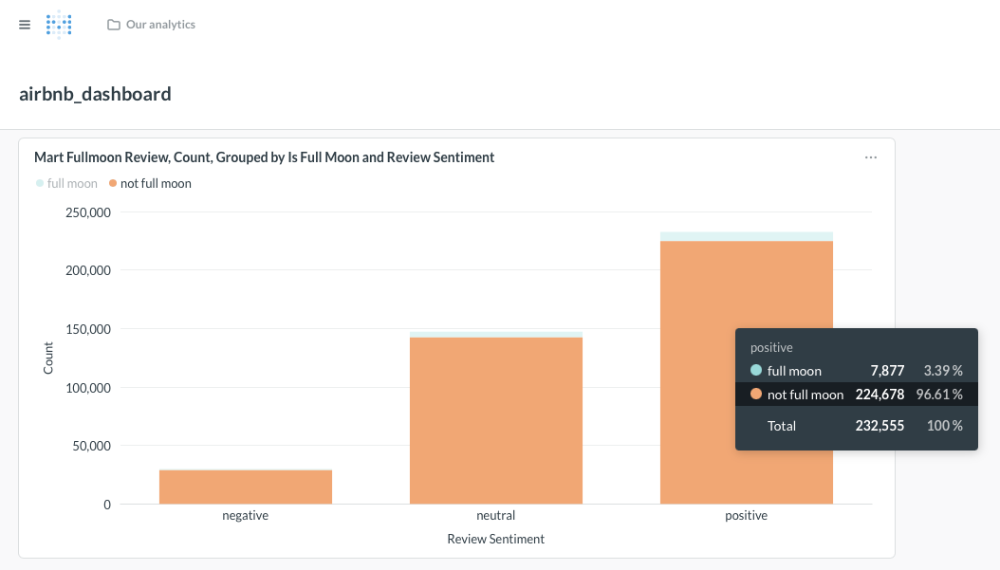
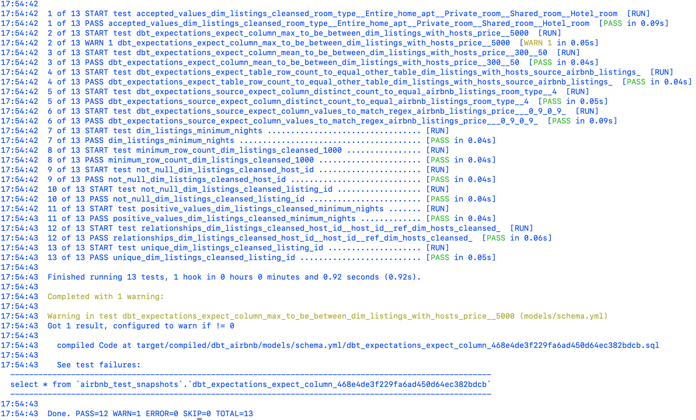

# Local setup — DBT + MySQL + Metabase (Airbnb example)

This folder contains everything you need to run a production-like, local data stack that ingests Airbnb CSVs into MySQL, applies DBT models and tests, and surfaces results in Metabase.

Checklist (what this README provides)
- Quick environment summary and versions
- Start MySQL + Metabase with Docker Compose
- Load raw CSVs into MySQL (using `extra.sql`)
- Run DBT (models, tests, docs) using the included `profiles.yml`
- Troubleshooting tips and notes about Docker volume paths

Project facts & versions
- DBT packages pinned in `requirements.txt`:
  - `dbt-core==1.7.19`
  - `dbt-mysql==1.7.0`
- DBT project folder: `dbt_airbnb/` (includes `dbt_project.yml`, models, and a `profiles.yml` for quick local use)
- MySQL initialization helper: `extra.sql` (creates `raw_*` tables and uses `LOAD DATA INFILE` to import CSVs mounted into the container)
- Docker Compose file: `docker/docker-compose.yml` (starts `mysql` and `metabase` services)

Prerequisites
- Docker & Docker Compose installed and running on your machine
- macOS (zsh) — commands below are tested for this environment
- Python 3.8+ if you want to run DBT natively; or use a virtualenv. Alternatively use `pip` inside the provided `.venv`.

1) Start MySQL and Metabase (Docker)
Open a terminal in this folder and start both services:

```bash
# from: /.../dbt-airbnb-mysql-metabase/local-setup/docker
docker compose up

# check status
docker compose ps
```

Notes:
- The compose file mounts persistent host paths under `/Users/<user_name>/Applications/docker-containers-donotdelete/...`.
  If those directories do not exist on your machine, edit `docker/docker-compose.yml` and change the host-side paths to a local directory you want to use for persistent data (e.g. `./pgdata` and `./metabase-data`).
- MySQL in the compose is configured with the following credentials (used by DBT `profiles.yml`):
  - user: `airbnb_user`
  - password: `airbnb_password`
  - database/schema: `airbnb`
  - root password: `root_password`

2) Load raw CSVs into MySQL
The `extra.sql` contains CREATE TABLE and `LOAD DATA INFILE` statements that expect the CSVs to be available under `/var/lib/mysql-files` inside the container. The compose mounts `../input_raw_data` there by default.

Run the SQL inside the MySQL container (macOS / zsh):

```bash
# copy any CSVs into local-setup/input_raw_data/<listings|reviews|hosts>/

# execute the helper SQL as root
docker exec -i mysql mysql -uroot -proot_password < extra.sql

# If you prefer to run interactively:
docker exec -it mysql mysql -uairbnb_user -pairbnb_password airbnb
# then run: source /var/lib/mysql-files/extra.sql  (or paste queries interactively)
```

3) Configure DBT to use the bundled `profiles.yml`
This repo includes a ready `profiles.yml` at:

```
local-setup/dbt_airbnb/profiles.yml
```

You can either copy it to your default DBT location or point DBT at the folder using an environment variable:

```bash
# Option A: copy to default location
mkdir -p ~/.dbt
cp dbt_airbnb/profiles.yml ~/.dbt/profiles.yml

# Option B: set DBT_PROFILES_DIR for this terminal only
export DBT_PROFILES_DIR="$PWD/dbt_airbnb"
```

The included profile connects to MySQL on `localhost:3306` and uses the `airbnb` schema (see the file for details).

4) Install DBT dependencies & run DBT (recommended: virtualenv)
Install using `pip` in your preferred environment. The pinned requirements are in `requirements.txt`.

```bash
# Create venv (if you want a fresh environment)
python3 -m venv .venv
source .venv/bin/activate
pip install -r requirements.txt

# From the dbt project folder
cd dbt_airbnb
dbt deps        # install packages if any
dbt debug       # validate connection & profiles
dbt run         # build models
dbt test        # run tests
dbt docs generate
dbt docs serve   # optional: opens docs locally
```

Notes on DBT version:
- This project uses `dbt-core==1.7.19` and `dbt-mysql==1.7.0`. If you have a different global dbt installation, prefer running dbt from the virtualenv above or a pinned environment so adapter incompatibilities are avoided.

5) Open Metabase and create a new MySQL data source
- Metabase UI is available at: http://localhost:3000
- Add a new database with the MySQL credentials above and the database/schema `airbnb`.
- Create questions and dashboards from DBT materialized tables (the `models/` folder in `dbt_airbnb` describes what each table contains).

6) Troubleshooting & tips
- If `LOAD DATA INFILE` fails, ensure the CSVs are readable by MySQL and are mounted at `/var/lib/mysql-files` inside the container. Check container logs:

```bash
docker logs mysql
```

- If DBT shows a `profiles.yml` error, confirm `DBT_PROFILES_DIR` is pointing to the folder that contains the `profiles.yml` (or copy it to `~/.dbt/profiles.yml`).
- If ports are in use (3306 or 3000), stop local services or change the host mapping in `docker/docker-compose.yml`.

7) Where to look in the repo
- DBT project: `dbt_airbnb/` — models, macros, tests, and `profiles.yml` for local runs.
- Raw CSVs (example input): `resources/input_raw_data/` (contains `listings/`, `reviews/`, `hosts/` subfolders)
- Docker compose and metabase storage: `docker/docker-compose.yml`, `docker/metabase-data/`
- MySQL import helper: `extra.sql`

Metabase Dashboard screenshot (example)


DBT Test Results Screenshot (example)

